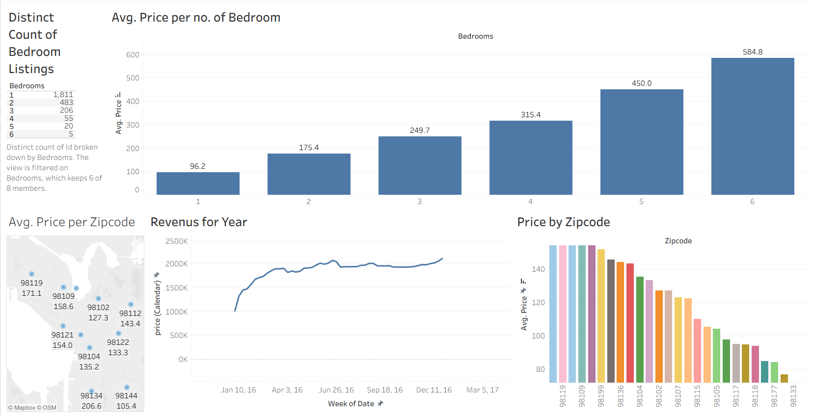

# 🏡 Airbnb Data Analysis Dashboard (Tableau)

## 🔍 Overview

This project presents an interactive Tableau dashboard analyzing Airbnb listing data to uncover pricing trends, revenue patterns, and key factors influencing listing performance.

## 🖼 Dashboard Preview

Interactive dashboard exploring pricing, revenue, and listing distribution across regions.

## 🎯 Business Problem

The objective is to help stakeholders understand:

* How pricing varies across locations and property types
* Which areas generate the highest revenue
* What factors influence listing performance

These insights can support pricing strategies, investment decisions, and market analysis.

## 📂 Dataset

The dataset includes Airbnb listings with features such as:

* Price
* Number of bedrooms
* Zipcode / Location
* Availability & yearly revenue
* Listing attributes across multiple tables

## 🛠 Tools Used

* Tableau
* Excel (data source)

## ⚙️ Data Preparation

* Performed joins across multiple tables to create a unified dataset
* Cleaned and structured data for analysis
* Ensured consistency across pricing and location fields

## 📊 Dashboard Features

* **Average Price by Number of Bedrooms**
* **Price Distribution by Zipcode**
* **Revenue Trends Over Time (Yearly)**
* **Count of Listings by Bedroom Type**
* Interactive filters for location and property characteristics

## 📈 Key Insights

* Listings with more bedrooms generally command higher prices, but with diminishing returns at higher levels
* Certain zipcodes consistently show premium pricing, indicating high-demand areas
* Revenue trends highlight seasonal or yearly growth patterns
* Smaller properties dominate listing counts, suggesting higher supply in lower-bedroom categories

## 💼 Business Recommendations

* Optimize pricing strategies based on bedroom count and location demand
* Focus investments in high-performing zipcodes
* Adjust pricing dynamically based on seasonal revenue trends
* Target high-demand property types for better returns

## ▶️ How to Use

1. Download the `.twbx` file from the `dashboard` folder
2. Open using Tableau Desktop
3. Use filters to explore pricing and revenue patterns

## 🚀 Outcome

Developed a dynamic Tableau dashboard that transforms raw Airbnb data into actionable insights for pricing optimization and market strategy.
